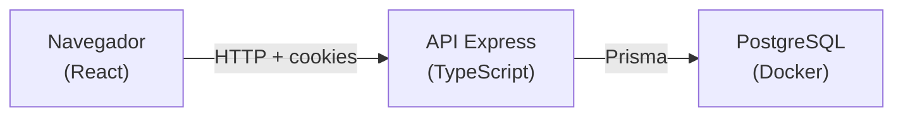

# Gestão AMA Itajaí

Sistema web para gestão institucional da [AMA Itajaí](https://amaitajai.org.br/) — organização que atende crianças e adolescentes com TEA. O projeto é desenvolvido pela equipe da UNIVALI (disciplina Programação Web) em parceria com a ONG.

Este repositório é um **monorepo** com duas aplicações:

| Pasta | O que é |
|---|---|
| [`frontend/`](frontend/) | Interface React (Vite) — o que o usuário vê no navegador |
| [`backend/`](backend/) | API REST em Express + Prisma — regras de negócio e banco de dados |

---

## Para novos integrantes da equipe

Se você acabou de entrar no projeto, siga esta ordem:

1. **Leia este README** — visão geral e como rodar localmente.
2. **Leia [`PROJETO-EXTENSAO.md`](PROJETO-EXTENSAO.md)** — contexto acadêmico, parceiro e objetivos.
3. **Consulte [`TODO.md`](TODO.md)** — o que já está pronto (`[x]`) e o que falta (`[ ]`).
4. **Antes de codar na agenda**, leia [`docs/README.md`](docs/README.md) e os arquivos em `docs/`.
5. **Escolha uma tarefa pendente** no `TODO.md` e avise o grupo para não duplicar trabalho.
6. **Siga o fluxo de qualidade** em [`AGENTS.md`](AGENTS.md) — testes no backend, `npm run build` no frontend.

### O que o sistema faz hoje

- **Login** com perfis `administrador` e `tecnico`
- **Pacientes** — cadastro, busca, edição, inativação, filtro por fonte de custeio
- **Agenda** — sessões em modalidade individual, dupla ou grupo; visualização dia/semana/mês; conflitos bloqueados; cancelamento; técnico confirma execução
- **Cadastros gerais** (só admin) — salas, modalidades, tipos de sessão, funcionários
- **Ocupação das salas** — grade semanal de uso por sala

### O que ainda não existe (mas já tem rota reservada)

Presença, check-in e fila de espera aparecem no código como módulos desabilitados (`ModuleComingSoonPage`). São os próximos alvos do MVP.

---

## Como o projeto se comunica



1. O **frontend** chama a API com Axios (`frontend/src/services/`).
2. A sessão fica em **cookie httpOnly** após o login — o navegador envia automaticamente.
3. O **backend** valida autenticação e perfil, aplica regras em `services/` e persiste via **Prisma**.
4. Respostas da API usam `_id` nos objetos (compatibilidade com convenção anterior do projeto).

---

## Setup local (primeira vez)

Pré-requisitos: **Node.js 20+** e **Docker** (para o PostgreSQL).

### 1. Banco de dados

```bash
cd backend
cp .env.example .env
docker compose up -d
npm install
npm run db:migrate
```

Opcional — popular tipos de sessão iniciais:

```bash
npm run db:seed:session-types
```

### 2. API

```bash
cd backend
npm run dev
```

API em `http://localhost:3000` · health: `GET /api/health`

### 3. Frontend

Em outro terminal:

```bash
cd frontend
cp .env.example .env
npm install
npm run dev
```

App em `http://localhost:5173`

### Credenciais de desenvolvimento

O primeiro usuário administrador costuma ser criado via seed ou script do time — pergunte a quem já rodou o projeto. Sem usuário no banco, o login não funciona.

---

## Estrutura do repositório

```
gestao-amaitajai/
├── frontend/          # React + Vite
├── backend/           # Express + Prisma + PostgreSQL
├── docs/              # Regras de negócio, modelagem, protocolo para IA
├── TODO.md            # Checklist feito / pendente
├── PROJETO-EXTENSAO.md
├── AGENTS.md          # Guia para agentes de IA e TDD
└── README.md          # Este arquivo
```

---

## Perfis de usuário

| Perfil | Acesso resumido |
|---|---|
| **administrador** | Pacientes, agenda completa, cadastros gerais, ocupação de salas |
| **tecnico** | Própria agenda; marcar sessão como realizada |

A configuração de menu e rotas protegidas está em `frontend/src/config/modules.js` e nos middlewares `backend/src/middlewares/`.

---

## Stack

| Camada | Tecnologia |
|---|---|
| Frontend | React 19, Vite, Tailwind CSS 4, shadcn/ui, React Router, Axios |
| Backend | Express 5, TypeScript, Prisma, PostgreSQL |
| Testes (backend) | Vitest + Supertest (sobe Postgres de teste via script) |

---

## Comandos úteis

| Onde | Comando | Para quê |
|---|---|---|
| `backend/` | `npm run dev` | API com hot reload |
| `backend/` | `npm test` | Testes de integração |
| `backend/` | `npm run typecheck` | Verificar tipos |
| `frontend/` | `npm run dev` | App com hot reload |
| `frontend/` | `npm run build` | Validar build de produção |

---

## Identidade visual

O tema segue a identidade da AMA Itajaí ([amaitajai.org.br](https://amaitajai.org.br/)):

| Token | Cor | Uso |
|---|---|---|
| `AmaBlueDark` | `#003B63` | Header, menus |
| `AmaBlue` | `#005E8F` | Botões primários |
| `AmaCyan` | `#00B5E2` | Destaques, estados ativos |
| `AmaLight` | `#EAF8FF` | Fundos suaves |
| `AmaText` | `#1F2A37` | Texto padrão |

No frontend, priorizar componentes em `frontend/src/components/ui/` (shadcn/ui) em vez de HTML solto para blocos reutilizáveis.

---

## Documentação

| Arquivo | Conteúdo |
|---|---|
| [`PROJETO-EXTENSAO.md`](PROJETO-EXTENSAO.md) | Contexto acadêmico e institucional |
| [`TODO.md`](TODO.md) | Status de implementação |
| [`docs/`](docs/) | Regras de negócio da agenda e modelagem |
| [`backend/README.md`](backend/README.md) | API, pastas, rotas, testes |
| [`frontend/README.md`](frontend/README.md) | Telas, features, convenções de UI |
| [`AGENTS.md`](AGENTS.md) | TDD e validação para contribuições com IA |

---

## Como contribuir (fluxo sugerido)

1. Atualize sua branch com `main` e crie uma branch para a tarefa.
2. Leia a documentação do módulo em `docs/` se for agenda ou cadastro.
3. **Backend:** escreva ou ajuste teste em `*.integration.test.ts` antes da implementação quando fizer sentido.
4. **Frontend:** rode `npm run build` ao finalizar.
5. Atualize `TODO.md` se a tarefa mudar o status de algo listado.
6. Para features da agenda, registre em `docs/features/` conforme [`docs/PROTOCOLO-IA.md`](docs/PROTOCOLO-IA.md).

Dúvidas de escopo com a ONG ficam listadas em `TODO.md` (seção “Validação com a ONG”) e em `docs/REGRAS-NEGOCIO-AGENDA.md`.
